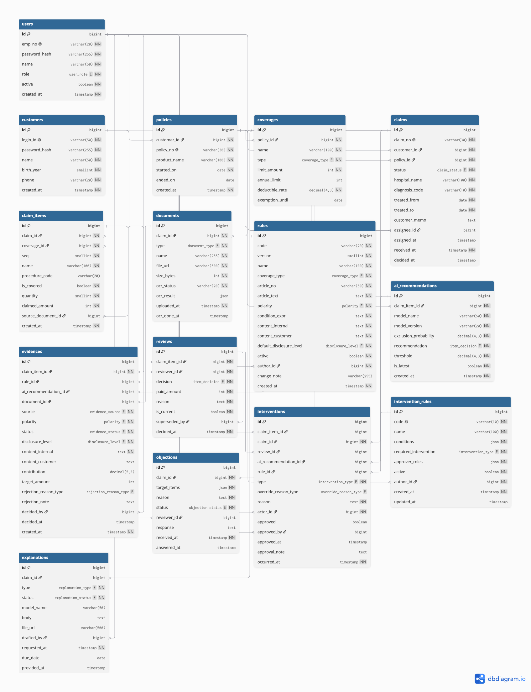

# CLAIM-TRACE

보험금 지급심사 근거 추적 및 인적 개입 기록 시스템.

> 규제가 요구하는 "누가 무엇을 근거로 결정했는가"의 기록을,
> 보험금 지급심사 도메인에서 데이터 모델과 API 계약으로 표현한 설계와 그 구현.

설계를 먼저 마치고 그 설계가 실제로 성립하는지를 구현으로 검증한 프로젝트다.
설계 산출물과 구현이 같은 저장소에 있고, 구현하면서 설계의 공백을 발견해
되먹인 기록도 함께 남겼다.

---

## 1. 무엇을 푸는 문제인가

> **AI가 참여한 보험금 지급심사에서, 누가 무엇을 근거로 결정했는지를
> 판정이 일어나는 시점에 기록하는 시스템.**

판정을 더 빠르게 하거나 더 정확하게 하는 시스템이 아니다. 판정의 **과정과
주체**를 남긴다.

### 해결하는 문제

지급심사 AI는 항목별 보상제외 확률을 산출해 자동 처리 대상과 사람 배분 대상을
가른다. 그런데 사람에게 넘어간 건에서 다음 세 가지가 시스템에 남지 않는다.

1. **항목별 판단 사유** — AI가 전달하는 것은 확률 하나이며, 왜 그 확률이
   나왔는지는 함께 전달되지 않는다
2. **AI 권고와 사람 판정의 분리** — 심사자가 AI 권고를 뒤집었는지, 뒤집었다면
   왜 그랬는지를 담을 자리가 없다
3. **검토했으나 배제한 근거** — 채택된 것만 남고 기각된 것은 사라진다

2026년 6월 22일 시행된 「금융분야 인공지능 가이드라인」은 이 세 가지의 기록과
보존을 요구한다. 기존 시스템은 그 요구가 생기기 전에 설계되었으므로 담을 자리
자체가 없다.

### 타겟 사용자

| 사용자 | 상황 | 달라지는 것 |
|---|---|---|
| **심사자** | AI가 걸러 넘긴 청구를 판정한다 | 근거를 항목 단위로 채택·기각하며, 그 판단이 자동으로 기록된다 |
| **심사관리자** | 심사 품질과 규제 준수를 책임진다 | 인적 개입 조건을 규칙으로 정의하고, 이행 여부를 확인한다 |
| **청구인** | 부지급·일부지급 통보를 받는다 | 항목별로 왜 그런 결과가 나왔는지 확인하고, 설명서를 신청하거나 이의를 제기한다 |

주 사용자는 심사자다. **심사자가 판단하는 순간이 기록이 만들어지는 유일한
시점**이기 때문이다.

### 핵심 가치

| | 가치 | 구현 |
|---|---|---|
| **G1** | AI 권고와 사람 판정을 물리적으로 분리해 기록한다 | `ai_recommendations` / `reviews` 테이블 분리, 개입 자동 기록 |
| **G2** | 판단 근거를 항목 단위로, 채택과 기각을 모두 남긴다 | `evidences` 교차 엔터티, 기각 사유 필수 |
| **G3** | 근거를 내부용과 고객용 두 수준으로 분리해 노출한다 | `disclosure_level` 컬럼, 고객 응답 필터링 |
| **G4** | 인적 개입 조건을 규칙으로 정의하고 그 이행을 강제한다 | `intervention_rules`, 복수인 확인 승인 |

### 설계 범위

| | |
|---|---|
| 다룬다 | 지급심사 AI 한 건에 대한 근거 기록 · 인적 개입 통제 · 고객 설명 |
| 다루지 않는다 | 처리 속도 개선, 서류 검토 자동화, AI 모델 학습, 보험사기 탐지, 전사 AI 거버넌스 |

---

## 2. 설계 산출물

설계는 별도 단계에서 완료했고 발표까지 마쳤다. 구현은 이 산출물을 입력으로
삼았다. 엔터티와 Enum은 DBML 그대로 매핑했고, 요청·응답 스키마는 API 명세를
따랐다.

| 산출물 | 내용 |
|---|---|
| [기술서](docs/CLAIMTRACE_기술서.md) | 문제 정의, 액터, 화면 16개, 설계 결정 D-1~D-8, 불변조건 13개, 예외 12개 |
| [ERD (DBML)](docs/schema.dbml) | 엔터티 15개, Enum 15개, 외래키 31개 |
| [API 명세 (OpenAPI 3.1)](docs/openapi.yml) | 엔드포인트 36개, request/response 스키마 |



### 산출물과 구현의 관계

**기술서와 API 명세는 설계 시점의 문서다.** 구현하면서 달라진 부분은 4장에
기록했고, 문서를 소급해 고치지 않았다. 설계가 무엇을 정했고 구현이 무엇을
드러냈는지가 둘 다 남아 있어야 한다고 보았다.

**DBML은 갱신했다.** ERD는 데이터 모델을 보여주는 그림이라, 구현과 다른
스키마를 그려두면 낡은 것이 아니라 틀린 것이 된다. 승인 기록 3컬럼 추가와
`intervention_rules` 테이블명 변경이 반영되어 있다.

**구현된 API는 실행해서 확인할 수 있다.** 서버를 띄우면 Swagger UI가 구현된
엔드포인트 8개를 정확한 스키마로 보여준다. 설계 명세(36개)와 구현 문서(8개)는
역할이 다르므로 둘 다 둔다.

---

## 3. 불변조건 13개와 검증 방법

**이 저장소에서 가장 보여주고 싶은 부분이다.**

설계 단계에서 "이 시스템에서 절대 성립해서는 안 되는 상태" 13가지를 정의했다.
구현은 이를 강제하고, 테스트는 각각을 위반하는 요청을 실제로 보내 지정된
예외가 반환되는지 확인한다.

| # | 불변조건 | 강제 지점 | 응답 |
|---|---|---|---|
| INV-1 | 모든 상태 전이에는 행위자가 있다 | NOT NULL · 행위자 조회 | 404 |
| INV-2 | 판정에는 사유가 있다 | 서비스 · 엔티티 생성자 | 400 `REVIEW_REASON_REQUIRED` |
| INV-3 | AI 권고와 다른 판정에는 오버라이드 사유와 개입 기록이 있다 | 서비스 | 400 `OVERRIDE_REASON_REQUIRED` |
| INV-4 | 규칙 조건에 해당하는 건은 단독 확정될 수 없다 | 서비스 | 403 `DUAL_CHECK_REQUIRED` |
| INV-5 | 부지급 설명서에는 부정적 근거가 1건 이상 포함된다 | 서비스 | 400 `NEGATIVE_EVIDENCE_REQUIRED` |
| INV-6 | 액터는 자신에게 배정된 자원만 접근한다 | 서비스 | 403 `CLAIM_NOT_ASSIGNED` |
| INV-7 | 확정된 청구의 근거는 변경되지 않는다 | 서비스 | 409 `CLAIM_ALREADY_DECIDED` |
| INV-8 | 국소 설명서에는 제공 기한이 있다 | 엔티티 팩토리 | — |
| INV-9 | 고객 응답에는 내부용 근거가 포함되지 않는다 | 근거의 공개 수준 | — |
| INV-10 | 모든 항목이 판정되어야 청구를 확정할 수 있다 | 서비스 | 400 `PENDING_ITEMS_EXIST` |
| INV-11 | 기각된 근거에는 기각 사유가 있다 | 서비스 · 엔티티 | 400 `REJECTION_REASON_REQUIRED` |
| INV-12 | 항목당 현재 판정은 정확히 1건 | 배타 잠금 · 부분 UNIQUE 인덱스 | — |
| INV-13 | 외부시스템 입력은 어떤 판정도 확정하지 않는다 | 구현 범위 밖 | — |

INV-8과 INV-9는 예외 코드가 없다. 전자는 생성 자체를 막고, 후자는 위반이
오류 응답이 아니라 정보 유출로 나타나기 때문이다. 그래서 INV-9는 "거부되는가"가
아니라 "본문에 내부용 내용이 섞이지 않았는가"로 검증한다.

### 오류 응답이 어느 규칙을 강제하는지 밝힌다

공통 오류 스키마에 `invariant` 필드를 두었다. 일반적인 API에는 없는 항목인데,
이 시스템에서 오류는 "요청이 잘못됐다"를 넘어 "설계가 금지한 상태를 만들려
했다"를 뜻하기 때문이다.

```json
{
  "code": "OVERRIDE_REASON_REQUIRED",
  "message": "AI 권고와 다른 판정에는 오버라이드 사유가 필요합니다",
  "invariant": "INV-3",
  "details": { "recommendation": "DENY", "decision": "PARTIAL" },
  "timestamp": "2026-09-17T10:22:33+09:00"
}
```

`details`는 무엇 때문에 걸렸는지를 구조화해 담는다. 위 응답을 받은 클라이언트는
"AI는 부지급을 권고했는데 일부지급으로 판정하셨습니다"를 화면에 그대로 띄울 수
있다.

### 테스트 76개

```
DomainTransitionTest          26   엔티티 상태 전이와 생성 규칙 (Spring 없음)
EvidenceInvariantTest         10   INV-6 · 7 · 11, D-3
ReviewInvariantTest           10   INV-1 · 2 · 3 · 6 · 7 · 12, D-6 · D-7
RuleEvaluatorTest             10   D-5 개입 규칙 평가 (Spring 없음)
DecisionInvariantTest          8   INV-4 · 10, 직무 분리, 승인 기록
ExplanationInvariantTest       5   INV-5 · 6 · 8 · 9
ClaimWorkflowIntegrationTest   3   판정부터 설명문 초안까지 전체 흐름
PostgresInvariantTest          3   INV-12 DB 제약 (Testcontainers)
ConcurrencyInvariantTest       1   INV-12 동시 요청
```

테스트는 HTTP 상태 코드만 보지 않는다. 응답의 `code`와 `invariant`까지 확인한다.
상태만 보면 다른 이유로 실패해도 통과하기 때문이다.

```java
saveReview(ITEM_MANUAL_THERAPY, REVIEWER, """
        {"decision":"PARTIAL","paidAmount":240000,"reason":"한도 내 일부를 지급한다."}
        """)
        .andExpect(status().isBadRequest())
        .andExpect(jsonPath("$.code").value("OVERRIDE_REASON_REQUIRED"))
        .andExpect(jsonPath("$.invariant").value("INV-3"))
        .andExpect(jsonPath("$.details.recommendation").value("DENY"));
```

---

## 4. 구현하면서 설계를 고친 것

설계는 발표까지 마쳤지만 완결된 것은 아니었다. 구현이 검증 수단이 되어 세 가지
공백을 드러냈다.

### 승인의 행위자가 기록되지 않았다

`interventions` 테이블에 `approved` 불리언만 있었다. 복수인 확인을 누가 승인했는지가
어디에도 남지 않는다.

INV-1은 모든 상태 전이에 행위자를 요구하고, 이 시스템의 전제가 "누가 무엇을
근거로 결정했는가"다. 직무 분리를 검사해 놓고 그 검사를 통과한 사람을 기록하지
않으면 통제가 성립하지 않는다. 사후에 "이 건은 누가 풀어줬는가"에 답할 수 없다.

`approved_by`, `approved_at`, `approval_note` 세 컬럼을 추가했다.

### INV-7이 종결된 청구를 막지 않았다

"확정된 청구의 근거는 변경되지 않는다"에서 확정은 `DECIDED`를 뜻했고, 그 이후
상태인 `CLOSED`는 규정되지 않았다. 지급까지 끝난 건의 근거를 고칠 수 있었다.

구현은 `DECIDED`와 `CLOSED`를 모두 잠근다. `OBJECTION`은 이의제기 재검토 중
근거 수정을 허용하는지가 정의되지 않아 공백으로 남겼다.

### 공개 수준과 고객용 문구의 관계가 없었다

근거는 공개 수준과 문구를 각각 들고 있는데, 둘의 관계를 강제하는 조건이 없었다.
공개 수준이 `CUSTOMER`인데 고객용 문구가 비면 설명문 생성 시 조용히 걸러진다.
심사자는 근거를 공개했다고 믿지만 고객 문서에는 나타나지 않는다.

**오류가 아니라 침묵으로 나타나는 문제라 더 위험하다.** 근거를 만드는 시점에
막았다.

---

## 5. 동시성 — 불변조건이 깨지는 것을 찾아내고 막기까지

INV-12는 "항목당 현재 판정은 정확히 1건"이다. 단일 요청에서는 성립했지만
동시 요청에서는 깨졌다.

### 재현

스레드 8개가 같은 항목에 동시에 판정을 저장하는 테스트를 작성했다.

```
동시 저장이 있어도 항목당 현재 판정은 정확히 1건이어야 한다 (INV-12)
==> expected: <1> but was: <8>
```

여덟 요청이 전부 현재 판정으로 저장됐다. 플래그 이관이 한 번도 일어나지 않았다.

### 원인

판정 저장은 이전 판정을 조회하고, 새 판정을 저장하고, 이전 판정의 플래그를
내린다. 두 요청이 동시에 첫 단계를 지나면 둘 다 "이전 판정 없음"을 읽는다.
물릴 대상을 찾지 못해 세 번째 단계가 실행되지 않는다.

드문 상황이 아니다. 심사자가 탭 두 개에서 저장하거나 응답이 느려 버튼을 두 번
누르면 재현된다.

### 두 층에서 막았다

| 층 | 수단 | 막는 것 |
|---|---|---|
| 애플리케이션 | 항목 행 배타 잠금 | 동시 요청을 직렬화한다. 요청은 거부되지 않고 대기 후 처리된다 |
| DB (PostgreSQL) | 부분 UNIQUE 인덱스 | 애플리케이션을 거치지 않는 쓰기에서도 잘못된 상태가 저장되지 않는다 |

```sql
CREATE UNIQUE INDEX uk_reviews_current
    ON reviews (claim_item_id) WHERE is_current;
```

애플리케이션 층만 두면 배치나 운영자의 직접 수정에서 무너지고, DB 층만 두면
정상적인 동시 요청이 오류로 떨어진다. 규제 대응 시스템에서 "기록이 조용히
어긋나는 것"과 "심사자가 저장에 실패하는 것" 중 어느 쪽도 감수할 수 없다.

### DB 제약이 코드의 오류를 드러냈다

부분 UNIQUE 인덱스를 추가하자 저장 순서가 틀렸다는 것이 드러났다. 새 판정을
먼저 저장하면 그 INSERT 시점에 현재 판정이 잠깐 2건이 되어 인덱스가 거부한다.

이전 판정의 플래그를 먼저 내려 반영한 뒤에 새 판정을 저장하도록 순서를 바꿨다.
그 결과 `Review`의 대체 처리가 두 단계로 나뉘었다. 상태 변경은 한 메서드로
묶는다는 원칙을 따르지 않은 유일한 자리이고, 그 이유를 코드 주석에 남겼다.

### 검증

`PostgresInvariantTest`는 Testcontainers로 실제 PostgreSQL을 띄운다.
`JdbcTemplate`으로 애플리케이션을 건너뛰고 직접 INSERT해서, 막는 주체가 DB임을
확인한다.

---

## 6. 개입 규칙 — 조건을 코드가 아니라 데이터에 둔다

가이드라인 보조수단성 ⑤는 "인적 개입 방식을 적용하는 기준이 **문서화**되어
있는가"를 묻는다. 코드에 묻힌 조건은 심사관리자가 확인할 수도 변경할 수도 없다.

개입 규칙의 발동 조건은 DB에 JSON으로 저장된다.

```json
[
  {"field": "coverageType",  "op": "eq",  "value": "DISEASE_UNCOVERED"},
  {"field": "claimedAmount", "op": "gte", "value": 300000}
]
```

`RuleEvaluator`가 이를 읽어 평가한다. 지원 필드는 `claimedAmount`,
`exclusionProbability`, `coverageType` 셋, 연산자는 `gte`, `lte`, `eq` 셋으로
한정했다. 기술서와 화면에 등장하는 규칙은 이 조합으로 전부 표현된다. 범용 조건
평가기를 만드는 것은 이 시스템이 증명하려는 명제와 무관하다.

승인 가능 역할도 같은 방식으로 규칙에 데이터로 들어 있다. 발동 조건만 데이터에
두고 승인 권한을 코드에 박으면 원칙이 반쪽만 적용된다.

`RuleEvaluatorTest`의 어느 테스트도 조건을 자바 코드로 표현하지 않는다. JSON
문자열만 바꿔 넣고 결과가 달라지는지를 본다.

---

## 7. 실행 방법

### 요구 사항

- JDK 21
- Docker (PostgreSQL 테스트에만 필요)

### 실행

```bash
./gradlew bootRun
```

| 주소 | 용도 |
|---|---|
| http://localhost:8080/api/swagger-ui.html | API 문서 및 실행 |
| http://localhost:8080/api/h2-console | DB 콘솔 (JDBC URL `jdbc:h2:mem:claimtrace`, User `sa`) |

H2 인메모리를 쓴다. 서버를 내리면 데이터가 사라지고 기동할 때마다 `data.sql`이
다시 적재된다. 심사 데이터를 영속시키는 것이 목적이 아니라 불변조건이 동작하는
것을 보이는 것이 목적이다.

### 인증 대신 헤더

인증은 구현 범위 밖이다. 행위자는 `X-Actor-Id` 헤더로 전달한다. 헤더를 읽는
곳은 `ActorResolver` 한 클래스뿐이라, 실제 인증을 붙일 자리가 코드에 한 군데로
표시되어 있다.

| ID | 사용자 | 역할 |
|---|---|---|
| 1 | 김영희 | 심사자 — 청구 1의 배정 심사자 |
| 2 | 이도현 | 심사자 — 청구 1에 배정되지 않음 (INV-6 확인용) |
| 3 | 박준호 | 심사관리자 — 복수인 확인 승인 권한 |

### 시드 데이터

| 청구 | 상태 | 용도 |
|---|---|---|
| `CLM-2026-0908-00412` | 심사중, 항목 4건, 판정 0건 | 전체 흐름 실행 |
| `CLM-2026-0901-00187` | 확정 완료 | INV-7 확인 |

2번 항목(도수치료)이 시연의 중심이다. 비급여 480,000원, AI 권고는 부지급,
보상제외 확률 0.82. 개입 규칙 `P-07`(비급여 고액)과 `P-03`(고위험 확률) 양쪽에
걸린다.

### 흐름 따라가기

Swagger UI에서 순서대로 실행하면 된다.

1. `POST /claim-items/{itemId}/reviews` — 항목 1~4 판정. 2번을 `PARTIAL`로 하면
   AI 권고를 뒤집는 것이므로 오버라이드 사유 없이는 400이 난다
2. `POST /claims/1/decision` — 개입 규칙이 요구한 승인이 없어 403
3. `PUT /admin/claims/1/dual-check` — `X-Actor-Id: 1`이면 본인 승인이라 403,
   `2`면 권한 없음이라 403, `3`이면 승인된다
4. `POST /claims/1/decision` — 확정된다
5. `PUT /evidences/2/status` — 확정 후라 409

### 테스트

```bash
./gradlew test
```

76개 전부 통과한다. 보고서는 `build/reports/tests/test/index.html`.

PostgreSQL 테스트는 Docker가 필요하다. Docker를 쓸 수 없으면 그 클래스만
실패하고 나머지 검증에는 영향이 없다.

---

## 8. 구현 범위와 제외 범위

**설계 36개 중 엔드포인트 8개를 구현했다.** 전부 만들면 CRUD가 백 개를 넘고
각각이 얕아진다. 규제 대응의 핵심 경로에 집중했다.

### 구현한 엔드포인트

| 엔드포인트 | 검증하는 불변조건 |
|---|---|
| `POST /claim-items/{itemId}/reviews` | INV-1 · 2 · 3 · 6 · 7 · 12 |
| `GET /claim-items/{itemId}/reviews` | — (판정 이력) |
| `POST /claim-items/{itemId}/evidences` | INV-6 · 7, 고객용 문구 존재 |
| `GET /claim-items/{itemId}/evidences` | — (근거 카드 목록) |
| `PUT /evidences/{evidenceId}/status` | INV-6 · 7 · 11 |
| `POST /claims/{claimId}/decision` | INV-4 · 6 · 10 |
| `POST /claims/{claimId}/explanations/draft` | INV-5 · 6 · 9 |
| `PUT /admin/claims/{claimId}/dual-check` | INV-4, 직무 분리 |

### 제외한 것

| 제외 | 이유 |
|---|---|
| 로그인·인증 | 흔한 CRUD이며 이 설계가 증명하려는 것과 무관하다 |
| 파일 업로드·OCR 연계 | 외부 시스템 연계가 필요하다. 시드 데이터로 결과 상태를 만들어 둔다 |
| 고객 포털 | 심사자 경로의 불변조건이 이 프로젝트의 대상이다 |
| 룰 매칭 엔진 | 근거 생성 규칙은 엔티티 팩토리로 표현하고 단위 테스트로 검증했다 |
| 자동 판정(STP) | AI는 어떤 상태도 확정하지 않는다는 전제와 충돌한다. 자동처리 대상은 배정 심사자가 없는 상태로 표현되어 있다 |

엔터티는 설계의 15개를 모두 매핑했다. 엔드포인트가 없는 상태 전이도 도메인
규칙으로는 검증한다. `DomainTransitionTest`가 그 자리다.

---

## 9. 기술 선택

```
Spring Boot 4.1.1 + Java 21
Spring Data JPA / Hibernate 7
H2 (인메모리) · PostgreSQL (프로파일)
springdoc-openapi 3.1.1
JUnit 5 + MockMvc + Testcontainers
Gradle
```

**Spring Boot 4.1.1** — 3.5 계열은 2026년 6월 30일 OSS 지원이 끝났다. 신규
프로젝트에 EOL 브랜치를 쓸 이유가 없다. Jackson 3 전환으로 `JsonMapper`를
주입받는 등 3.x 예제와 다른 지점이 있다.

**Testcontainers 1.21.4** — 2.0에서 `junit-jupiter` 모듈이 재편되었다. 검증된
1.x 계열 마지막 버전을 썼다.

**Lombok을 엔티티에 제한적으로 사용** — `@Data`는 쓰지 않았다. `equals`/`hashCode`가
전체 필드를 훑고 `toString`이 연관 엔티티를 따라가며 지연 로딩을 터뜨린다.
`@Getter`, `@NoArgsConstructor(PROTECTED)`, `@Builder`만 쓰고 setter는 만들지
않았다. 상태 변경은 `claim.decide(at)`, `evidence.reject(...)`처럼 의미 있는
이름의 메서드로만 한다.

**금액과 확률은 `BigDecimal`** — `double`은 0.3을 정확히 표현하지 못한다. 지급액의
원 단위 오차와 임계값 경계에서의 판정 흔들림은 심사 결과에 대한 신뢰를 직접 깎는다.

---

## 10. 저장소 구조

```
src/main/java/com/claimtrace/
├── config/        OpenAPI 문서 구성
├── controller/    4개 — 요청 수신과 행위자 결정만 한다
├── domain/        엔티티 15개 + Enum 15개
├── dto/           요청·응답 스키마
├── exception/     오류 코드, 전역 예외 처리
├── repository/    10개
├── service/       6개 — 불변조건 검증이 전부 여기 있다
└── support/       ActorResolver

src/test/java/com/claimtrace/invariant/    테스트 76개
```

컨트롤러는 불변조건을 검사하지 않는다. 같은 규칙을 컨트롤러마다 되풀이하면
어느 한 곳이 빠졌을 때 우회 경로가 생긴다. 예외도 잡지 않는다. 모든 오류
응답은 `GlobalExceptionHandler` 한 곳에서 만들어져야 형태가 일정하다.

---

## 11. 다음 단계

- 이의제기 재검토 경로 — 엔티티와 상태 전이는 있으나 엔드포인트가 없다
- 설명서 발급 — 초안 생성까지 구현했다. 심사자의 확정 절차가 남았다
- 낙관적 락 — 현재 경합 지점은 판정 저장 하나이고 비관적 락으로 충분하다.
  동시 수정 지점이 늘면 재검토가 필요하다
