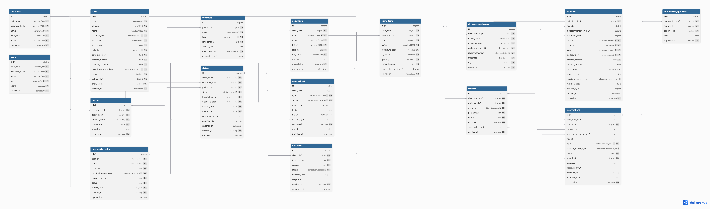

# CLAIM-TRACE

보험금 지급심사 근거 추적 및 인적 개입 기록 시스템.

> 규제가 요구하는 "누가 무엇을 근거로 결정했는가"의 기록을,
> 보험금 지급심사 도메인에서 데이터 모델과 API 계약으로 표현한 설계와 그 구현.

설계를 먼저 마치고 그 설계가 실제로 성립하는지를 구현으로 검증한 프로젝트다.
설계 산출물과 구현이 같은 저장소에 있고, 구현하면서 설계의 공백을 발견해
되먹인 기록도 함께 남겼다.

---

## 1. 무엇을 푸는 문제인가

> **AI가 참여한 보험금 지급심사에서, 누가 무엇을 근거로 결정했는지를
> 판정이 일어나는 시점에 기록하는 시스템.**

판정을 더 빠르게 하거나 더 정확하게 하는 시스템이 아니다. 판정의 **과정과
주체**를 남긴다.

### 해결하는 문제

지급심사 AI는 항목별 보상제외 확률을 산출해 자동 처리 대상과 사람 배분 대상을
가른다. 그런데 사람에게 넘어간 건에서 다음 세 가지가 시스템에 남지 않는다.

1. **항목별 판단 사유** — AI가 전달하는 것은 확률 하나이며, 왜 그 확률이
   나왔는지는 함께 전달되지 않는다
2. **AI 권고와 사람 판정의 분리** — 심사자가 AI 권고를 뒤집었는지, 뒤집었다면
   왜 그랬는지를 담을 자리가 없다
3. **검토했으나 배제한 근거** — 채택된 것만 남고 기각된 것은 사라진다

2026년 6월 22일 시행된 「금융분야 인공지능 가이드라인」은 이 세 가지의 기록과
보존을 요구한다. 기존 시스템은 그 요구가 생기기 전에 설계되었으므로 담을 자리
자체가 없다.

### 타겟 사용자

| 사용자 | 상황 | 달라지는 것 |
|---|---|---|
| **심사자** | AI가 걸러 넘긴 청구를 판정한다 | 근거를 항목 단위로 채택·기각하며, 그 판단이 자동으로 기록된다 |
| **심사관리자** | 심사 품질과 규제 준수를 책임진다 | 인적 개입 조건을 규칙으로 정의하고, 이행 여부를 확인한다 |
| **청구인** | 부지급·일부지급 통보를 받는다 | 항목별로 왜 그런 결과가 나왔는지 확인하고, 설명서를 신청하거나 이의를 제기한다 |

주 사용자는 심사자다. **심사자가 판단하는 순간이 기록이 만들어지는 유일한
시점**이기 때문이다.

### 핵심 가치

| | 가치 | 구현 |
|---|---|---|
| **G1** | AI 권고와 사람 판정을 물리적으로 분리해 기록한다 | `ai_recommendations` / `reviews` 테이블 분리, 개입 자동 기록 |
| **G2** | 판단 근거를 항목 단위로, 채택과 기각을 모두 남긴다 | `evidences` 교차 엔터티, 기각 사유 필수 |
| **G3** | 근거를 내부용과 고객용 두 수준으로 분리해 노출한다 | `disclosure_level` 컬럼, 고객 응답 필터링 |
| **G4** | 인적 개입 조건을 규칙으로 정의하고 그 이행을 강제한다 | `intervention_rules`, 복수인 확인 승인 |

### 설계 범위

| | |
|---|---|
| 다룬다 | 지급심사 AI 한 건에 대한 근거 기록 · 인적 개입 통제 · 고객 설명 |
| 다루지 않는다 | 처리 속도 개선, 서류 검토 자동화, AI 모델 학습, 보험사기 탐지, 전사 AI 거버넌스 |

---

## 2. 설계 산출물

설계는 별도 단계에서 완료했고 발표까지 마쳤다. 구현은 이 산출물을 입력으로
삼았다. 엔터티와 Enum은 DBML 그대로 매핑했고, 요청·응답 스키마는 API 명세를
따랐다.

| 산출물 | 내용 |
|---|---|
| [기술서](docs/CLAIMTRACE_기술서.md) | 문제 정의, 액터, 화면 14개, 설계 결정 D-1~D-8, 불변조건 13개, 예외 12개 |
| [ERD (DBML)](docs/schema.dbml) | 엔터티 16개, Enum 15개, 외래키 33개 |
| [API 명세 (OpenAPI 3.0)](docs/openapi.yml) | 엔드포인트 36개, request/response 스키마 |



### 산출물과 구현의 관계

**기술서와 API 명세는 설계 시점의 문서다.** 구현하면서 달라진 부분은 4장에
기록했고, 문서를 소급해 고치지 않았다. 설계가 무엇을 정했고 구현이 무엇을
드러냈는지가 둘 다 남아 있어야 한다고 보았다.

**DBML은 갱신했다.** ERD는 데이터 모델을 보여주는 그림이라, 구현과 다른
스키마를 그려두면 낡은 것이 아니라 틀린 것이 된다. 승인 기록 3컬럼 추가,
`intervention_approvals` 테이블 추가, `intervention_rules` 테이블명 변경이
반영되어 있다.

**구현된 API는 실행해서 확인할 수 있다.** 서버를 띄우면 Swagger UI가 구현된
엔드포인트 9개를 정확한 스키마로 보여준다. 설계 명세(36개)와 구현 문서(9개)는
역할이 다르므로 둘 다 둔다.

---

## 3. 불변조건 13개와 검증 방법

**이 저장소에서 가장 보여주고 싶은 부분이다.**

설계 단계에서 "이 시스템에서 절대 성립해서는 안 되는 상태" 13가지를 정의했다.
구현은 이를 강제하고, 테스트는 각각을 위반하는 요청을 실제로 보내 지정된
예외가 반환되는지 확인한다.

| # | 불변조건 | 강제 지점 | 응답 |
|---|---|---|---|
| INV-1 | 모든 상태 전이에는 행위자가 있다 | NOT NULL · 행위자 조회 | 404 |
| INV-2 | 판정에는 사유가 있다 | 서비스 · 엔티티 생성자 | 400 `REVIEW_REASON_REQUIRED` |
| INV-3 | AI 권고와 다른 판정에는 오버라이드 사유와 개입 기록이 있다 | 서비스 | 400 `OVERRIDE_REASON_REQUIRED` |
| INV-4 | 규칙 조건에 해당하는 건은 단독 확정될 수 없다 | 서비스 | 403 `DUAL_CHECK_REQUIRED` |
| INV-5 | 부지급 설명서에는 부정적 근거가 1건 이상 포함된다 | 서비스 | 400 `NEGATIVE_EVIDENCE_REQUIRED` |
| INV-6 | 액터는 자신에게 배정된 자원만 접근한다 | 서비스 | 403 `CLAIM_NOT_ASSIGNED` |
| INV-7 | 확정된 청구의 근거는 변경되지 않는다 | 서비스 | 409 `CLAIM_ALREADY_DECIDED` |
| INV-8 | 국소 설명서에는 제공 기한이 있다 | 엔티티 팩토리 | — |
| INV-9 | 고객 응답에는 내부용 근거가 포함되지 않는다 | 근거의 공개 수준 | — |
| INV-10 | 모든 항목이 판정되어야 청구를 확정할 수 있다 | 서비스 | 400 `PENDING_ITEMS_EXIST` |
| INV-11 | 기각된 근거에는 기각 사유가 있다 | 서비스 · 엔티티 | 400 `REJECTION_REASON_REQUIRED` |
| INV-12 | 항목당 현재 판정은 정확히 1건 | 배타 잠금 · 부분 UNIQUE 인덱스 | — |
| INV-13 | 외부시스템 입력은 어떤 판정도 확정하지 않는다 | 구현 범위 밖 | — |

INV-4는 표의 문구와 구현의 검사 기준이 다르다. 문구는 "규칙 조건에 해당하는
건"이지만 확정 서비스가 보는 것은 조건이 아니라 `interventions`에 남은 행이다.
규칙 평가는 판정을 저장할 때만 일어나고, 확정은 그때 기록된 개입이 해소됐는지만
본다. 확정 시점에 다시 평가하면 그 사이 수정된 규칙이 이미 끝난 판정에 소급
적용되고, 화면 12가 그것을 금지했기 때문이다.

**두 기준이 같은 결과를 내는 것은 "판정을 저장한 뒤로 조건의 입력값이 변하지
않는다"는 전제 위에서다.** 지금은 성립한다. 판정 저장이 청구의 전 항목을 매번
평가하고, AI 권고를 새로 넣거나 규칙을 수정하는 경로가 구현 범위에 없다. 전제가
깨지는 조건과 그때 할 일은 11장에 적었다.

INV-8과 INV-9는 예외 코드가 없다. 전자는 생성 자체를 막고, 후자는 위반이
오류 응답이 아니라 정보 유출로 나타나기 때문이다. 그래서 INV-9는 "거부되는가"가
아니라 "본문에 내부용 내용이 섞이지 않았는가"로 검증한다.

### 오류 응답이 어느 규칙을 강제하는지 밝힌다

공통 오류 스키마에 `invariant` 필드를 두었다. 일반적인 API에는 없는 항목인데,
이 시스템에서 오류는 "요청이 잘못됐다"를 넘어 "설계가 금지한 상태를 만들려
했다"를 뜻하기 때문이다.

```json
{
  "code": "OVERRIDE_REASON_REQUIRED",
  "message": "AI 권고와 다른 판정에는 오버라이드 사유가 필요합니다",
  "invariant": "INV-3",
  "details": { "recommendation": "DENY", "decision": "PARTIAL" },
  "timestamp": "2026-09-17T10:22:33+09:00"
}
```

`details`는 무엇 때문에 걸렸는지를 구조화해 담는다. 위 응답을 받은 클라이언트는
"AI는 부지급을 권고했는데 일부지급으로 판정하셨습니다"를 화면에 그대로 띄울 수
있다.

요청 형식이 틀린 경우도 같은 형식으로 나간다. `X-Actor-Id` 헤더 누락, 정의되지
않은 enum 값, 깨진 JSON은 컨트롤러에 들어오기 전에 Spring이 거부해, 처음에는
`code`가 없는 Spring 기본 400이 나갔다. 전역 처리기에 두 예외를 추가해
`INVALID_REQUEST`로 응답하고, enum 값이 틀리면 필드·입력값·허용값을 `details`에
담는다. 경로·메서드·미디어 타입이 맞지 않는 요청(404 · 405 · 415)은 어느
엔드포인트에도 닿지 않은 것이라 기본 형식으로 두었다. 실패 테스트를 먼저 커밋하고
고쳤다.

### 테스트 98개

```
DomainTransitionTest          26   엔티티 상태 전이와 생성 규칙 (Spring 없음)
EvidenceInvariantTest         14   INV-6 · 7 · 11, D-3, 공개 수준과 문구
ReviewInvariantTest           15   INV-1 · 2 · 3 · 6 · 7 · 12, D-6 · D-7, 지급액
RuleEvaluatorTest             10   D-5 개입 규칙 평가 (Spring 없음)
DecisionInvariantTest         11   INV-4 · 10, 직무 분리, 승인 기록과 처리 이력
ExplanationInvariantTest       5   INV-5 · 6 · 8 · 9
ClaimWorkflowIntegrationTest   3   판정부터 설명문 초안까지 전체 흐름
PostgresInvariantTest          3   INV-12 DB 제약 (Testcontainers)
ConcurrencyInvariantTest       1   INV-12 동시 요청
ErrorResponseFormatTest        3   요청 형식 오류의 공통 오류 형식
RecommendationIntakeTest       7   INV-7 · 13, D-4 AI 권고 수신
```

테스트는 HTTP 상태 코드만 보지 않는다. 응답의 `code`와 `invariant`까지 확인한다.
상태만 보면 다른 이유로 실패해도 통과하기 때문이다.

```java
saveReview(ITEM_MANUAL_THERAPY, REVIEWER, """
        {"decision":"PARTIAL","paidAmount":240000,"reason":"한도 내 일부를 지급한다."}
        """)
        .andExpect(status().isBadRequest())
        .andExpect(jsonPath("$.code").value("OVERRIDE_REASON_REQUIRED"))
        .andExpect(jsonPath("$.invariant").value("INV-3"))
        .andExpect(jsonPath("$.details.recommendation").value("DENY"));
```

---

## 4. 구현하면서 설계를 고친 것

설계는 발표까지 마쳤지만 완결된 것은 아니었다. 구현이 검증 수단이 되어 여섯 가지
공백을 드러냈다.

### 승인의 행위자가 기록되지 않았다

`interventions` 테이블에 `approved` 불리언만 있었다. 복수인 확인을 누가 승인했는지가
어디에도 남지 않는다.

INV-1은 모든 상태 전이에 행위자를 요구하고, 이 시스템의 전제가 "누가 무엇을
근거로 결정했는가"다. 직무 분리를 검사해 놓고 그 검사를 통과한 사람을 기록하지
않으면 통제가 성립하지 않는다. 사후에 "이 건은 누가 풀어줬는가"에 답할 수 없다.

`approved_by`, `approved_at`, `approval_note` 세 컬럼을 추가했다.

### 그 승인 기록이 반려 이력을 덮어썼다

위 세 컬럼을 추가하고 나서도 절반만 해결되어 있었다. 승인·반려가 개입 행의
같은 자리를 **제자리에서 덮어쓴다**.

반려된 개입은 `approved = false`라 `blocksDecision()`이 참으로 남는다. 확정을
계속 막는다는 뜻이고, 동시에 승인 대기 목록에도 그대로 남는다는 뜻이다. 서류를
보완해 같은 엔드포인트로 다시 승인하면 통과하는데, 그 순간 **누가 왜 반려했는지가
사라진다.** 공개 API를 두 번 호출하면 재현된다.

판정은 대체되어도 이전 판정이 이력으로 남는다(D-6). 통제 승인만 덮어쓰는
비대칭이었다. 보조수단성 ⑧이 요구하는 것은 개입 사실의 기록이 아니라 그 내용의
기록이므로, 반려 사유가 남지 않으면 통제가 성립하지 않는다.

**개입 1건에 처리 N건으로 나눴다.** `interventions`는 "규칙이 이 청구에 복수인
확인을 요구했다"는 사실 하나를 뜻하고, 그 요구가 어떻게 처리되었는지는 여러 번
일어날 수 있다. `intervention_approvals` 테이블을 추가해 처리할 때마다 한 행씩
쌓는다. 추가만 하고 수정·삭제하지 않는다.

현재 상태 필드와 `blocksDecision()`, INV-4의 검사 대상은 그대로 두었다. 이 변경은
판정을 바꾸지 않고 기록만 보탠다. 이력 조회 엔드포인트가 없으므로 승인 응답에
`approvals`로 실어 보낸다 — 기록이 남아도 보이지 않으면 절반만 달성된 것이다.

### 승인 뒤 판정을 바꿔도 다시 승인받지 않았다

도수치료를 240,000원 일부 지급으로 판정해 지급 총액 613,200원으로 승인받은 뒤,
심사자가 같은 항목을 480,000원 전액 지급으로 바꾸면 853,200원이 그대로 확정됐다.
늘어난 240,000원은 누구의 확인도 거치지 않았다.

판정 저장은 규칙을 평가해 승인 대기 개입을 만드는데, 같은 규칙의 개입이 **이미
있으면** 건너뛰었다. 여러 항목을 차례로 판정할 때 대기 레코드가 쌓이지 않게 하려던
검사가, 이미 승인된 개입까지 "있음"으로 본 것이다. 규칙의 발동 조건은
청구금액·담보 분류·권고 확률만 보고 판정 내용은 보지 않으므로, 판정을 바꿔도 같은
규칙이 발동하고 같은 검사에 걸린다.

설계에는 승인이 무엇을 확인한 것인지가 정의되어 있지 않았다. 승인은 **승인 당시의
판정**을 확인한 것으로 보았다. 같은 규칙의 개입이 모두 승인된 상태에서 판정이
저장되면 새 승인 대기 개입을 만든다. 앞선 승인은 지우거나 되돌리지 않는다. 그
승인이 있었다는 것도 이력이고, 새 대기 개입이 확정을 다시 막는 것으로 충분하다.

`DecisionInvariantTest`에 위 금액 그대로 실패하는 테스트를 먼저 커밋하고 고쳤다.
남은 한계도 있다. 승인 기록이 어느 판정 버전을 보았는지 직접 가리키지 않아 시각으로만
추론할 수 있고, 같은 내용으로 다시 저장해도 재승인을 요구한다. 판정 스냅샷은 11장의
규칙 버전 고정과 같은 방식이라 그때 함께 다룬다.

### INV-7이 종결된 청구를 막지 않았다

"확정된 청구의 근거는 변경되지 않는다"에서 확정은 `DECIDED`를 뜻했고, 그 이후
상태인 `CLOSED`는 규정되지 않았다. 지급까지 끝난 건의 근거를 고칠 수 있었다.

구현은 `DECIDED`와 `CLOSED`를 모두 잠근다. `OBJECTION`은 이의제기 재검토 중
근거 수정을 허용하는지가 정의되지 않아 공백으로 남겼다.

### INV-6이 조회에는 적용되지 않았다

INV-6은 "모든 조회·수정 API에서 소유권 검사"라고 규정했지만, 같은 문서의 API 표는
근거 목록과 판정 이력 조회에 INV-6을 달지 않았다. 구현은 API 표를 따라 두 조회에서
행위자를 받지 않았고, 헤더 없이도, 배정되지 않은 심사자도 내부용 문구와 AI 기여도를
그대로 받았다.

그대로 INV-6을 적용하면 이번에는 복수인 확인을 승인하는 심사관리자가 막힌다. 승인할
판정의 근거를 볼 수 없으면 승인은 형식만 남는다. 그래서 조회는 **배정 심사자와
심사관리자**에게 허용하고 수정은 배정 심사자에게만 둔다. 기준은
`Claim.isReadableBy` 한 곳에 두어 두 조회가 같은 규칙을 쓴다. 실패 테스트를 먼저
커밋하고 고쳤다.

### 공개 수준과 고객용 문구의 관계가 없었다

근거는 공개 수준과 문구를 각각 들고 있는데, 둘의 관계를 강제하는 조건이 없었다.
공개 수준이 `CUSTOMER`인데 고객용 문구가 비면 설명문 생성 시 조용히 걸러진다.
심사자는 근거를 공개했다고 믿지만 고객 문서에는 나타나지 않는다.

**오류가 아니라 침묵으로 나타나는 문제라 더 위험하다.** 근거를 만드는 시점에
막았다.

### 그 검사가 근거 추가에만 있었다

공개 수준은 근거를 추가할 때만 정하는 값이 아니다. 근거 상태 변경 요청도
`disclosureLevel`을 함께 받아, 채택하면서 공개 수준을 바꿀 수 있다. 그런데 위 검사는
근거 추가에만 있었다. 내부용이고 고객용 문구가 없는 AI 근거를 채택하며 `CUSTOMER`로
바꾸면 200이 나왔고, 막으려던 침묵이 그대로 재현되었다.

검사를 근거 추가와 상태 변경이 함께 쓰는 메서드 하나로 모았다. 상태 변경 요청에는
문구 필드가 없으므로 근거가 이미 가진 문구로 판단하고, 채택·기각보다 먼저 검사해
거부된 요청이 상태를 일부만 바꿔 두지 않게 했다. 같은 규칙을 두 경로에 따로 두면
한쪽에만 남는다는 것을 보여준 사례다. 실패 테스트를 먼저 커밋하고 고쳤다.

### AI 권고 값의 출처가 없었다

AI 권고 수신 명세는 항목별 확률과 임계값만 받는데, 권고(지급·일부지급·부지급)는
그 둘로 계산되지 않는다. 시드만 봐도 임계값 0.3에서 0.61은 일부지급, 0.82는
부지급이다. 시스템이 확률 구간으로 권고를 만들어 내면 모델이 내리지 않은 판단이
모델의 권고로 기록되고, INV-3의 오버라이드 판별이 그 가짜 권고를 기준으로 돈다.
요청에 `recommendation`을 추가해 모델이 보낸 값을 그대로 저장한다.

### 판정과 지급액의 관계가 없었다

판정과 지급액은 별도 컬럼인데, 둘이 서로 맞아야 한다는 조건이 없었다. 청구금액
24,000원 항목에 99,999,999원 지급, 부지급인데 144,000원, 일부지급인데 0원이 모두
저장되었고, 확정의 지급 총액은 이 값을 그대로 더한다.

판정을 저장할 때 세 가지를 막는다. 청구금액을 넘는 지급액, 금액이 있는 부지급,
0원인 지급·일부지급이다. 지급도 자기부담을 공제하므로 청구금액보다 적을 수 있어,
지급과 일부지급을 금액으로 구분하지는 않는다. 담보 한도는 청구 여러 건에 걸쳐
쌓이는 값이라 이 검사에 넣지 않았다. 세 경우의 실패 테스트를 먼저 커밋하고 고쳤다.

---

## 5. 동시성 — 불변조건이 깨지는 것을 찾아내고 막기까지

INV-12는 "항목당 현재 판정은 정확히 1건"이다. 단일 요청에서는 성립했지만
동시 요청에서는 깨졌다.

### 재현

스레드 8개가 같은 항목에 동시에 판정을 저장하는 테스트를 작성했다.

```
동시 저장이 있어도 항목당 현재 판정은 정확히 1건이어야 한다 (INV-12)
==> expected: <1> but was: <8>
```

여덟 요청이 전부 현재 판정으로 저장됐다. 플래그 이관이 한 번도 일어나지 않았다.

### 원인

판정 저장은 이전 판정을 조회하고, 새 판정을 저장하고, 이전 판정의 플래그를
내린다. 두 요청이 동시에 첫 단계를 지나면 둘 다 "이전 판정 없음"을 읽는다.
물릴 대상을 찾지 못해 세 번째 단계가 실행되지 않는다.

드문 상황이 아니다. 심사자가 탭 두 개에서 저장하거나 응답이 느려 버튼을 두 번
누르면 재현된다.

### 두 층에서 막았다

| 층 | 수단 | 막는 것 |
|---|---|---|
| 애플리케이션 | 항목 행 배타 잠금 | 동시 요청을 직렬화한다. 요청은 거부되지 않고 대기 후 처리된다 |
| DB (PostgreSQL) | 부분 UNIQUE 인덱스 | 애플리케이션을 거치지 않는 쓰기에서도 잘못된 상태가 저장되지 않는다 |

```sql
CREATE UNIQUE INDEX uk_reviews_current
    ON reviews (claim_item_id) WHERE is_current;
```

애플리케이션 층만 두면 배치나 운영자의 직접 수정에서 무너지고, DB 층만 두면
정상적인 동시 요청이 오류로 떨어진다. 규제 대응 시스템에서 "기록이 조용히
어긋나는 것"과 "심사자가 저장에 실패하는 것" 중 어느 쪽도 감수할 수 없다.

### DB 제약이 코드의 오류를 드러냈다

부분 UNIQUE 인덱스를 추가하자 저장 순서가 틀렸다는 것이 드러났다. 새 판정을
먼저 저장하면 그 INSERT 시점에 현재 판정이 잠깐 2건이 되어 인덱스가 거부한다.

이전 판정의 플래그를 먼저 내려 반영한 뒤에 새 판정을 저장하도록 순서를 바꿨다.
그 결과 `Review`의 대체 처리가 두 단계로 나뉘었다. 상태 변경은 한 메서드로
묶는다는 원칙을 따르지 않은 유일한 자리이고, 그 이유를 코드 주석에 남겼다.

### 검증

`PostgresInvariantTest`는 Testcontainers로 실제 PostgreSQL을 띄운다.
`JdbcTemplate`으로 애플리케이션을 건너뛰고 직접 INSERT해서, 막는 주체가 DB임을
확인한다.

---

## 6. 개입 규칙 — 조건을 코드가 아니라 데이터에 둔다

가이드라인 보조수단성 ⑤는 "인적 개입 방식을 적용하는 기준이 **문서화**되어
있는가"를 묻는다. 코드에 묻힌 조건은 심사관리자가 확인할 수도 변경할 수도 없다.

개입 규칙의 발동 조건은 DB에 JSON으로 저장된다.

```json
[
  {"field": "coverageType",  "op": "eq",  "value": "DISEASE_UNCOVERED"},
  {"field": "claimedAmount", "op": "gte", "value": 300000}
]
```

`RuleEvaluator`가 이를 읽어 평가한다. 지원 필드는 `claimedAmount`,
`exclusionProbability`, `coverageType` 셋, 연산자는 `gte`, `lte`, `eq` 셋으로
한정했다. 기술서와 화면에 등장하는 규칙은 이 조합으로 전부 표현된다. 범용 조건
평가기를 만드는 것은 이 시스템이 증명하려는 명제와 무관하다.

승인 가능 역할도 같은 방식으로 규칙에 데이터로 들어 있다. 발동 조건만 데이터에
두고 승인 권한을 코드에 박으면 원칙이 반쪽만 적용된다.

`RuleEvaluatorTest`의 어느 테스트도 조건을 자바 코드로 표현하지 않는다. JSON
문자열만 바꿔 넣고 결과가 달라지는지를 본다.

---

## 7. 실행 방법

### 요구 사항

- JDK 21
- Docker (PostgreSQL로 실행하거나 PostgreSQL 테스트를 돌릴 때만 필요)

### 실행

```bash
./gradlew bootRun
```

| 주소 | 용도 |
|---|---|
| http://localhost:8080/api/swagger-ui.html | API 문서 및 실행 |
| http://localhost:8080/api/h2-console | DB 콘솔 (JDBC URL `jdbc:h2:mem:claimtrace`, User `sa`) |

H2 인메모리를 쓴다. 서버를 내리면 데이터가 사라지고 기동할 때마다 `data.sql`이
다시 적재된다. 심사 데이터를 영속시키는 것이 목적이 아니라 불변조건이 동작하는
것을 보이는 것이 목적이다.

PostgreSQL에서 INV-12의 부분 UNIQUE 인덱스까지 걸린 상태로 띄우려면 다음과 같다.

```bash
docker compose up -d
./gradlew bootRun --args='--spring.profiles.active=postgres'
```

접속 정보는 `DB_URL`, `DB_USERNAME`, `DB_PASSWORD` 환경변수로 바꿀 수 있다.
H2와 마찬가지로 기동할 때마다 스키마와 시드를 새로 만든다.

### 인증 대신 헤더

인증은 구현 범위 밖이다. 행위자는 `X-Actor-Id` 헤더로 전달한다. 헤더를 읽는
곳은 `ActorResolver` 한 클래스뿐이라, 실제 인증을 붙일 자리가 코드에 한 군데로
표시되어 있다.

| ID | 사용자 | 역할 |
|---|---|---|
| 1 | 김영희 | 심사자 — 청구 1의 배정 심사자 |
| 2 | 이도현 | 심사자 — 청구 1에 배정되지 않음 (INV-6 확인용) |
| 3 | 박준호 | 심사관리자 — 복수인 확인 승인 권한 |

### 시드 데이터

| 청구 | 상태 | 용도 |
|---|---|---|
| `CLM-2026-0908-00412` | 심사중, 항목 4건, 판정 0건 | 전체 흐름 실행 |
| `CLM-2026-0901-00187` | 확정 완료 | INV-7 확인 |

2번 항목(도수치료)이 시연의 중심이다. 비급여 480,000원, AI 권고는 부지급,
보상제외 확률 0.82. 개입 규칙 `P-07`(비급여 고액)과 `P-03`(고위험 확률) 양쪽에
걸린다.

### 흐름 따라가기

Swagger UI에서 순서대로 실행하면 된다.

1. `POST /claim-items/{itemId}/reviews` — 항목 1~4 판정. 2번을 `PARTIAL`로 하면
   AI 권고를 뒤집는 것이므로 오버라이드 사유 없이는 400이 난다
2. `POST /claims/1/decision` — 개입 규칙이 요구한 승인이 없어 403
3. `PUT /admin/claims/1/dual-check` — `X-Actor-Id: 1`이면 본인 승인이라 403,
   `2`면 권한 없음이라 403, `3`이면 승인된다
4. `POST /claims/1/decision` — 확정된다
5. `PUT /evidences/2/status` — 확정 후라 409

### 테스트

```bash
./gradlew test
```

99개(불변조건 98 + 기동 확인 1) 전부 통과한다. 보고서는 `build/reports/tests/test/index.html`.

PostgreSQL 테스트는 Docker가 필요하다. Docker를 쓸 수 없으면 그 클래스만
실패하고 나머지 검증에는 영향이 없다.

---

## 8. 구현 범위와 제외 범위

**설계 36개 중 엔드포인트 9개를 구현했다.** 전부 만들면 CRUD가 백 개를 넘고
각각이 얕아진다. 규제 대응의 핵심 경로에 집중했다.

### 구현한 엔드포인트

| 엔드포인트 | 검증하는 불변조건 |
|---|---|
| `POST /claim-items/{itemId}/reviews` | INV-1 · 2 · 3 · 6 · 7 · 12 |
| `GET /claim-items/{itemId}/reviews` | INV-6 (배정 심사자 · 심사관리자) |
| `POST /claim-items/{itemId}/evidences` | INV-6 · 7, 고객용 문구 존재 |
| `GET /claim-items/{itemId}/evidences` | INV-6 (배정 심사자 · 심사관리자) |
| `PUT /evidences/{evidenceId}/status` | INV-6 · 7 · 11 |
| `POST /claims/{claimId}/decision` | INV-4 · 6 · 10 |
| `POST /claims/{claimId}/explanations/draft` | INV-5 · 6 · 9 |
| `PUT /admin/claims/{claimId}/dual-check` | INV-4, 직무 분리 |
| `POST /external/claims/{claimId}/recommendations` | INV-7 · 13, D-4 |

### 제외한 것

| 제외 | 이유 |
|---|---|
| 로그인·인증 | 흔한 CRUD이며 이 설계가 증명하려는 것과 무관하다 |
| 파일 업로드·OCR 연계 | 외부 시스템 연계가 필요하다. 시드 데이터로 결과 상태를 만들어 둔다 |
| 고객 포털 | 심사자 경로의 불변조건이 이 프로젝트의 대상이다 |
| 룰 매칭 엔진 | 근거 생성 규칙은 엔티티 팩토리로 표현하고 단위 테스트로 검증했다 |
| 자동 판정(STP) | AI는 어떤 상태도 확정하지 않는다는 전제와 충돌한다. 자동처리 대상은 배정 심사자가 없는 상태로 표현되어 있다 |

엔터티는 설계의 15개를 모두 매핑했고, 구현 중 추가한 `intervention_approvals`까지
16개다. 엔드포인트가 없는 상태 전이도 도메인 규칙으로는 검증한다. `DomainTransitionTest`가 그 자리다.

---

## 9. 기술 선택

```
Spring Boot 4.1.1 + Java 21
Spring Data JPA / Hibernate 7
H2 (인메모리) · PostgreSQL (프로파일)
springdoc-openapi 3.1.1
JUnit 5 + MockMvc + Testcontainers
Gradle
```

**Spring Boot 4.1.1** — 3.5 계열은 2026년 6월 30일 OSS 지원이 끝났다. 신규
프로젝트에 EOL 브랜치를 쓸 이유가 없다. Jackson 3 전환으로 `JsonMapper`를
주입받는 등 3.x 예제와 다른 지점이 있다.

**Testcontainers 1.21.4** — 2.0에서 `junit-jupiter` 모듈이 재편되었다. 검증된
1.x 계열 마지막 버전을 썼다.

**Lombok을 엔티티에 제한적으로 사용** — `@Data`는 쓰지 않았다. `equals`/`hashCode`가
전체 필드를 훑고 `toString`이 연관 엔티티를 따라가며 지연 로딩을 터뜨린다.
`@Getter`, `@NoArgsConstructor(PROTECTED)`, `@Builder`만 쓰고 setter는 만들지
않았다. 상태 변경은 `claim.decide(at)`, `evidence.reject(...)`처럼 의미 있는
이름의 메서드로만 한다.

**금액은 원 단위 `Integer`, 확률은 `BigDecimal`** — 원화에는 소수 단위가 없으므로
금액은 정수로 충분하다. 확률은 다르다. `double`은 0.3을 정확히 표현하지 못하고,
임계값 경계에서의 판정 흔들림은 심사 결과에 대한 신뢰를 직접 깎는다.

---

## 10. 저장소 구조

```
src/main/java/com/claimtrace/
├── config/        OpenAPI 문서 구성
├── controller/    5개 — 요청 수신과 행위자 결정만 한다
├── domain/        엔티티 16개 + Enum 15개
├── dto/           요청·응답 스키마
├── exception/     오류 코드, 전역 예외 처리
├── repository/    11개
├── service/       7개 — 불변조건 검증이 전부 여기 있다
└── support/       ActorResolver

src/test/java/com/claimtrace/invariant/    테스트 98개
```

컨트롤러는 불변조건을 검사하지 않는다. 같은 규칙을 컨트롤러마다 되풀이하면
어느 한 곳이 빠졌을 때 우회 경로가 생긴다. 예외도 잡지 않는다. 모든 오류
응답은 `GlobalExceptionHandler` 한 곳에서 만들어져야 형태가 일정하다.

---

## 11. 다음 단계

- 이의제기 재검토 경로 — 엔티티와 상태 전이는 있으나 엔드포인트가 없다
- 설명서 발급 — 초안 생성까지 구현했다. 심사자의 확정 절차가 남았다. 청구가
  확정되었는지는 이 발급 단계에서 검사한다. 초안은 일부러 확정 전에도 만들 수 있게
  두었다. 판정 확정은 INV-5를 검사하지 않고, 확정 뒤에는 INV-7 때문에 근거를 보탤
  수 없다. 초안을 확정 뒤로 미루면 고객용 부정 근거가 빠진 부지급 건은 확정 후에야
  INV-5에 걸리고, 설명서를 영영 만들 수 없게 된다. 확정 전 초안이 그 점검을 맡는다
- 낙관적 락 — 현재 경합 지점은 판정 저장 하나이고 비관적 락으로 충분하다.
  동시 수정 지점이 늘면 재검토가 필요하다

### INV-4의 전제가 깨지는 날

확정 서비스는 규칙을 다시 평가하지 않고 기록된 개입만 본다(3장). 다음 둘 중
하나를 구현하는 순간 그 전제가 깨지고, **규칙이 발동했는데 개입 기록이 없는
청구가 확정될 수 있다.**

- AI 권고 수신 경로 — 모델이 판정 저장 이후에 권고를 넣으면, 그 확률로 발동할
  규칙(P-03 등)이 평가된 적 없는 채로 남는다
- 개입 규칙 관리 화면 — 심사관리자가 규칙을 추가하면 같은 일이 일어난다

그때 함께 들어가야 할 것:

1. **규칙 버전 고정.** 규칙 수정이 기존 행을 고치지 않고 새 버전 행을 만들고,
   `interventions`가 평가에 쓴 조건 스냅샷을 든다. 그러면 "판정 당시 기준"이
   데이터로 보존되어 소급 문제가 사라진다. `updated_at` 시각 비교를 검토했으나
   그 컬럼은 갱신 주체가 없고 이전 조건값도 남기지 않아 기준이 못 된다
2. **확정 시점 재평가.** 1이 있어야 소급 없이 가능하다. 입력값 변화만 반영하고
   규칙 변경은 반영하지 않는다
3. **트랜잭션 분리.** 확정은 `@Transactional`이고 INV-4 위반 시 예외를 던지므로,
   같은 트랜잭션에서 개입을 기록하면 차단과 함께 롤백된다. 확정은 막혔는데
   승인 대기 목록에는 아무것도 뜨지 않는 상태가 되어, 통제를 더하는 대신 결함을
   만든다

권고가 없는 항목을 확정 전에 어떻게 다룰지도 정해지지 않았다. 현재는 확률
조건이 만족되지 않아 규칙이 발동하지 않고, 그 항목은 통제 없이 지나간다.
